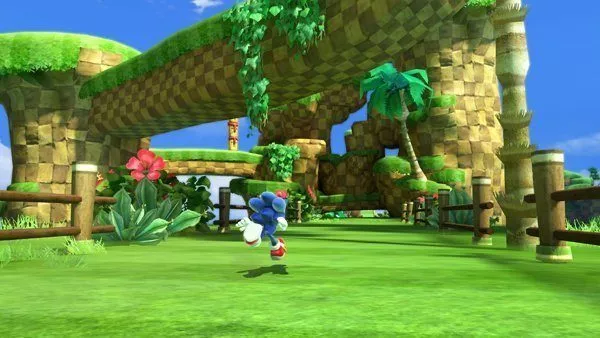
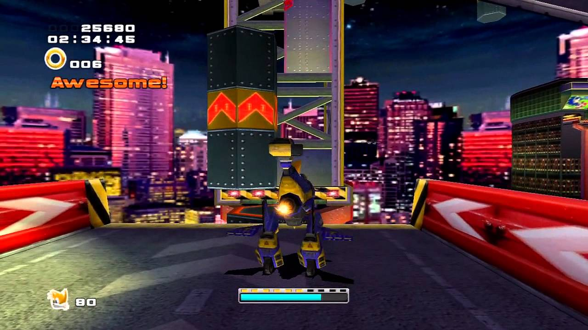
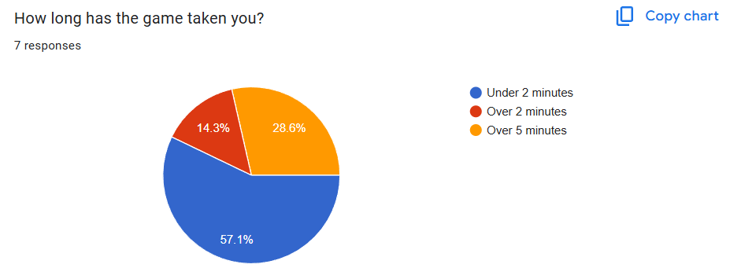
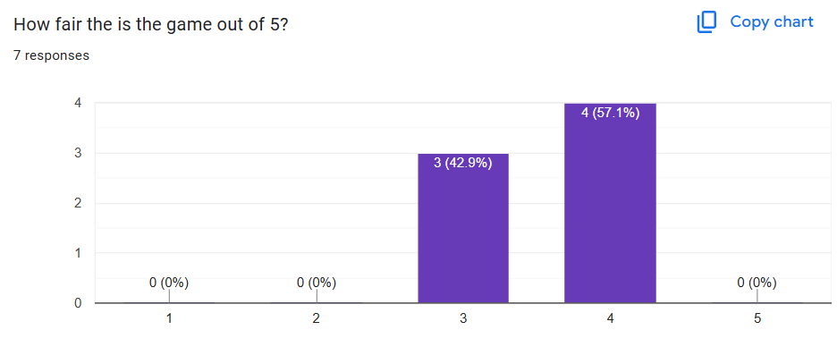
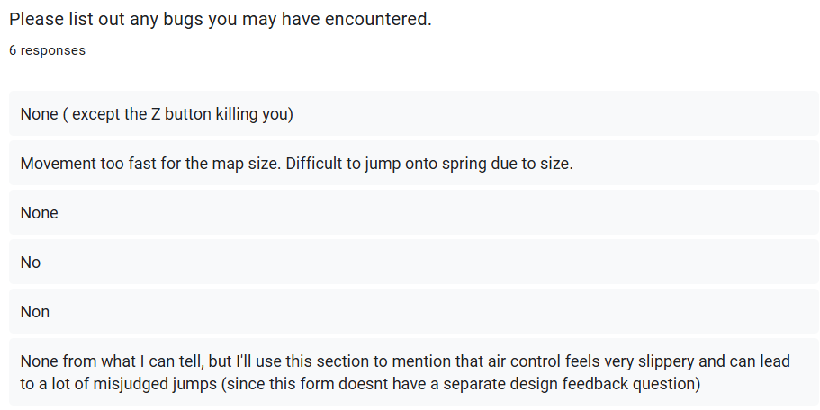
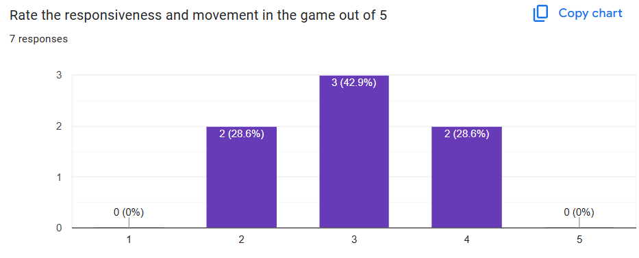

# FGCT4015: Fundamentals of Games Development 25/26

### Zuzanna Pawelczyk

### 2506784

### Repository Link
### Build Link
### Demo Video

## Abstract 

My goal is to create a Unreal Engine 3D game, focusing on the style of platformer with inspiration being Sonic games. My plan is to create a platformer where the task is to collect a certain amount of coins before reaching the end goal and finishing the game. You play as a little creature avoiding spike enemies that try to damage you and traverse moving platforms, disapearing platforms, wall jumping and springs. 

My Goals:
    A Moving Actor in the form of moving platforms around the map that the player has to traverse over, the platforms can range from ones that move on the x-axis or on the y-axis. As well as disapearing platforms once you stand on them that reapear after a certain amount of time. 
    An AI behaviour tree to create an enemy for the player to avoid, the enemy would patrol around their section of the stage and have a limited view infront of them that when the player walks infront the enemy locks on the player and follows them, damaging them if they colide with the enemy. The enemy would not be able to be killed.
    An interface where when the player clicks a certain button it interacts with the object in a certain radius around the player. This could be used for the ending goal, if the player reachs the end the can click the E button to interact with the goal, if they have enough coins to succeed the game will progress to a win screen and then stop the game, if they do not have enough coins then the game continues until they succeed.
    An Event dispatcher, where one actor changes, other objects are aware of the change and respond to this change. This can be used for the coins to spawn them all back in once the player dies. 
    A collection or array to store values like a score.
    A variable that is editable directly in the editor so that it's easier to change outside of the blueprints, for example the health of the player character.
    A UI to show the health, coin collections and instructions to what the player must do to beat the game. I would need an UI for the begining of the game for the player to start the game or quit or look at the controls, as well as display to the player when they have won the game. As well as add sound for the coin collection as well as background ambience music for the game.

## Research

### Methodology

I will approach my work by looking through Sonic games that focus on the 3D platformer style, to see what elements the game has that i could try and implmenet into my own game. I will be looking at examples through youtube tutorials on how to use Unreal and it's blueprints. Near the end of my game progresss I had 8 people do a guided test to observe how people react to my game and what issues they have.

### Games Sources

My initial point of inspiriation is Sonic Generations. 

This game is created by Sega in 2011 for their 20th aniversary, it's an extremely popular game that got a remake in 2024 adding more content. The game has both 3D and 2D gameplay with overall 3D models, the game is linear with minimal branch paths to get to an end goal. On the way to the goal, Sonic runs through collecting rings, bouncing off springs and avoiding different robotic enemies. Sonic also has the ability to double jump, stomp and wall jump on certain specific walls which I want to add into my own game. In a stage called Green Hill, there are platforms that fall once Sonic steps on them, after a certain amount of time they reapear for Sonic to be able to walk over them again, this inspired me to create my own disapearing platforms. 

My second inspiration was Sonic Adventure 2.

Sonic Adventure 2 is a game created in 2001 for their 5th aniversary as a last resort to save the franchise, which allowed the franchise to continue on due to it's success. Contrary to Sonic Generations where the stages are more linear and it does not have the boost formula therefore there's more time to explore the stage overall than having to run straight through the stage. As I cant replicate the boost formula and the length and extreme speed of the Sonic Generations stage, I am taking Sonic Adventure 2 as inspiration for the layout of stages and for the slower approach for the stage. In the stage, City Escape, there are platforms that are tubes that move up and down to cross bottomless pits, this was my inspiration for the moving platforms. 

### Doccumentation Sources 

To help with making the game I used a multtitude of different youtube tutorials as sources as well as the official Unreal Websites as help to figure out different elements of my game that I wanted to include.

(Learn Blueprints in Unreal Engine 5 - Beginner Tutorial) I used this video to help with learning how to initially learn blueprints within Unreal as this is my first time using Unreal. This was insanely helpful to learn the basics of Unreal. 

(How to Make a Moving Platform in Unreal Engine 5) I used this to create the moving platforms using interp movement, this allows me to create multiple different platforms that all move to a different area and at different speeds. With this I created platforms that moved side to side as well as up and down.

(How To Make Disappearing/Reappearing Platforms In Unreal Engine 4 - UE4 Tutorial) I used this to learn how to make platforms disapear with their visibility and reapear after a certain time or once being collided with, this is very useful as actors that are destroyed can not be restored easily in Unreal so instead of destroying them I can make them disapear. 

(How to Make A Behavior Tree in Unreal Engine 5 Tutorial ( Complete Guide )) With this I was able to create an enemy AI and allow the AI behaviour to walk and patrol around the area, moving to a random area after waiting for a few seconds to keep look out for the player.

(Event Dispatchers | Unreal Engine 5 Tutorial) I used this to help with the coins that needed an event dispatcher to spawn back in after the player dies. 

(The Easiest Way to Make a Simple Enemy AI in Unreal Engine 5) I used this example to help finish my enemy AI by adding the ability for the enemy to be able to see the player, and then follow them and damage them. 

(How To Make Wall Jump and Slide In Unreal Engine 5) I used this to help with getting the character to wall jump as well as stick to the walls that are wall jump-able to allow the player the room to react and jump off onto the next wall. With this I was also able to make it a function that any wall can be in the editor menu changed to allow the player to wall jump against it.

### Implementation

#### Process

The first elemented I wanted to include into the game was collectable coins, which initially would destroy themselves upon being collided with the player. However later on when I added the possibility for the player to die, coins would not respawn automatically, therefore instead of destroying the actor upon collision I had the actor change visibility to be invisible, have an event dispatcher when the player dies that then triggers the coins to be visible again. I was able to alter the player for the player to have a double jump within the editor menu. I then was able to create invisible platforms with collision underneath the map so that when the player falls off the map, they die.

With the inspiration of Sonic games in mind, I created my own springs, where they increase the players upwards velocity upon collision, I used Unreal's preset Jump Pad as vague inspiriation on how to perform this. With the coins being in the game, I created a UI that has a text on screen updating every single time a coin is collected, this luckily already automatically sets back to zero upon death as the UI updating is a part of the player. After that I created a second UI that is triggered by a button press of P, it's part of the player button controls, when the button is clicked the UI menu is triggered to open, and sets mouse controls. On this UI I created a few buttons with the children of text so that the text is register as part of the button, one button turns of the UI and unpauses the game, another button exits the game, and the third button opens the controls menu. The controls menu is set on the same UI menu as the pause screen, it's just invisible while the ui is up, upon clicking the Controls button, the pause screen turns invisible and the controls menu is now visible and has the information on the buttons and it's own button to go back to the pause menu.

I then also created an Interface, where upon a button click thats wired into the player's controls, the player can interact with different objects that have access to this interface. with this I created an end goal that you can interact with the E button, if the player has enough coins the game will end and trigger a UI that tells the player they won before going back the start menu UI. The start menu UI is actually just the pause menu UI but it collects data on if the player has died, if the player has died, the text of "Game paused" and the button "resume" instead changes to be "Play Game" and "Play", if the player hasnt died between opening the menu again, which would imply the player is pausing the game, the pause menu alteration shows up instead.

Using interp movement I then able to create moving platforms, interp movement allows for the same type of platform have different positions they are moving to and different speed, with this I was able to create a platform that moves on the X-axis, as well as tubes that move up and down and level at different times. I wanted to create disapearing/moving platforms, which initially I used the interp movement, however interp movement wouldnt trigger upon collision. Instead I then made the platforms destroy themselves upon being colided with after a delay, this would lead to them disapearing after the player walks over them, however I wanted the platforms to them reapear. Once an object is destroyed it can not respawn again in a way that I know how to make work, so instead of making the platforms destroy themselves, I had them set their visibility and collision to invisible, and after a certain amount of time they would reapear and be able to walk over again. This allowed for the platforms to disapear upon being walked over, and then reapear again.

I wanted to add the ability for the player to stomp down, as the player has a much faster speed and glide through air for much longer the movement can be much harder to grasp while playing, so I wanted to introduce the stomp button. With the stomp button the player can on demand drop straight down, this was as simple as binding a button to the decrease of the player's velocity. The next player movement I wanted to add was wall jumping, with that I created a whole new wall type that was wall jump-able for the player, the player then has a trace line that registers if the player is close enough to the wall. When the player colides with the wall their down movement slows down to allow the player to slide down the wall and have enough time to react, when they jump again they are flung away from the wall. 

Finally, I gave the player a health UI, when the health drops down to zero the player dies. With this I created an Ai, this Ai patrols around the nav mesh of it's area, waiting for a few seconds before then moving again to another area, if the Ai spots the player the Ai will run after the player, and upon coliding with the Ai, the player looses health. The AI is meant to look like a little spike ball but I've had issues with carrying over static meshes created in blender because if the mesh does not have a skeleton the Ai can not move anymore. 

#### New Approaches

This was my first ever time using Unreal Engine, I looked much more into youtube videos and tutorials on how to do things than official doccumentation. 

#### User Testing

Once my game was done, except for the graphics, I had 7 different users play through my game and review it with a survey to be able to see how people react to the gameplay and mechanics, all being played on Windows 11. The test was a guided so I was able to notice how many players struggled with the gameplay, despite this I still asked every player to note how long the game took them even if they didn't beat the entire game. This leads to a very divided response where, players who did not finish the game have a under 2 minutes response, while players that did finish the game have a over 2 or 5 minutes response.

Despite the alarming difficulty of the game which led to many not finishing the game, alot of the users agreed on the game being either fair or half-way there to being fair, I think this comes from the movement being as slippery as it is.

I had then asked the players to review what bugs they had experienced while playing, overall players did not note any bugs, but general issues with the movement being too slippery and too fast for the map size. The only major bug, was not a bug at all and just dev way of killing the player to test menu's and respawns, and the player accidently clicked the button while playing (the Z button), this has been removed now to avoid people dying by misclicking on the keyboard.

Overall, the user's opinion on the movement and responsiveness of the game was in between being average or poor, this makes me aware of the fact that the player's movement is too slippery and fast. As well as how players were not aware of the stomp button to help their movement control, which is why after the survery I added the seperate UI menu which tells the player what buttons the player has access to.

### Outcome

### Reflection

#### Research Effectiveness

The research I did massively helped me and I was able to create most of the things that I wanted in inspiration of a Sonic game, however there were major issues with more specific coding I wanted to do where I'd have to sit through alot of videos to find the section of video that actually finally helped.

#### Positive Analysis

I was able to create a rather fun game and include alot of mechanics that I initally wanted, with wall jumping, stomping, disapearing and moving platforms just like Sonic games do. 

#### Negative Analysis

I was unable to add any of the 3D models I wanted as I was unable to figure out how to export blender models into Unreal with their skeletons so the game is bare in it's design, as well as I was unable to get much music for the game other than the sound effect for collecting coins. The movement is much too slippery and hard to control, and I was unable to find a play to implement any Arrays into the game like I wanted to.

#### Next Time

I really enjoyed the genre of this platformer, I would like to work more on different things platformers have, their different movement sets mainly. I would like to add more 3D models into the game next time, make it much more pretty without Unreal base models.

### Declared Assets

The 3D models for the player and the Ai are just the base 3D models from Unreal Engine.

### References

